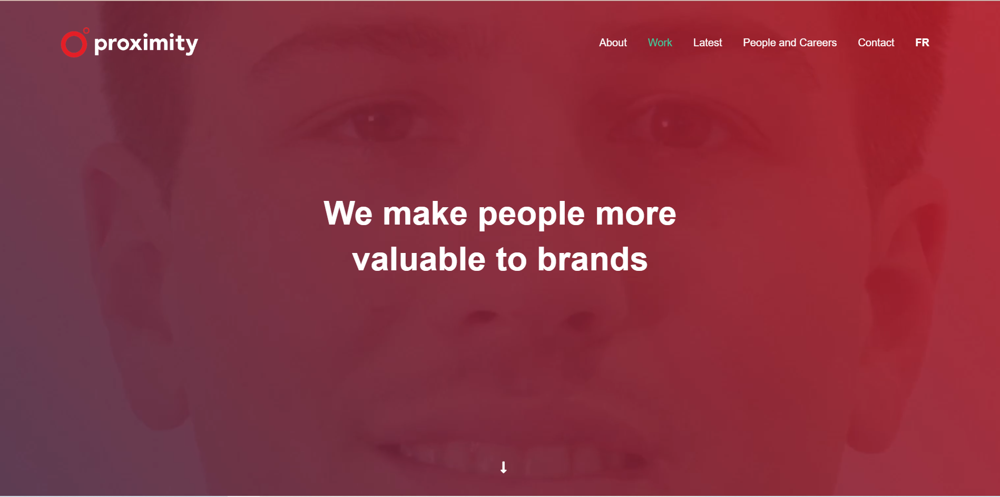

# Frontend-test

## Proximity Front-end Developer Test

- This is a frontend developer test for the position of frontend engineer at Proximity.
- This technologies used in this project are HTML, CSS and Javascript.
- Bootstrap is the main web framework used for the design with Jquery for functionality.
- The file structure is as simple as possible with all required assets in the assets folder.
- The only tool required to run this project is a working browser.

## Hosted Demo Link

Demo Link: [proximity-test.surge.sh](https://proximity-test.surge.sh/)

## Quick Overview

This is the file tree structure

```
Frontend-test
│
├── README.md
├── LICENSE
├── index.html
└── assets
    └── css
    │    └── main.css
    ├── font
    │    ├── Avenir-Black.ttf
    │    ├── Avenir-Book.ttf
    │    └── Avenir-Medium.ttf
    ├── img
    │    ├── background-img.jpg
    │    ├── logo.png
    │    └── pencil.gif
    └── video
        └── video.mp4
```

## Preview

<p align='left'>
    
</p>
<p align='left'>
    
</p>

## License

Proximity-test is open source software [licensed as MIT](https://github.com/grimsammie/Frontend-test/blob/master/LICENSE).